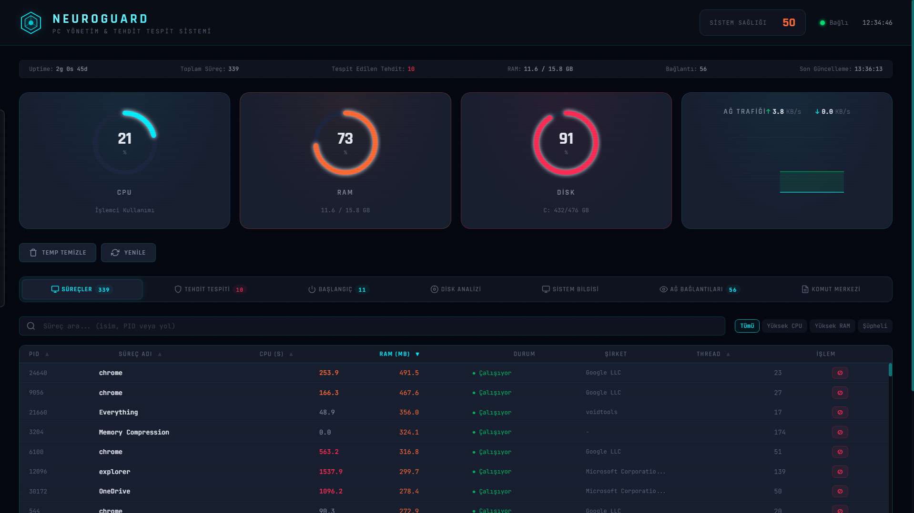
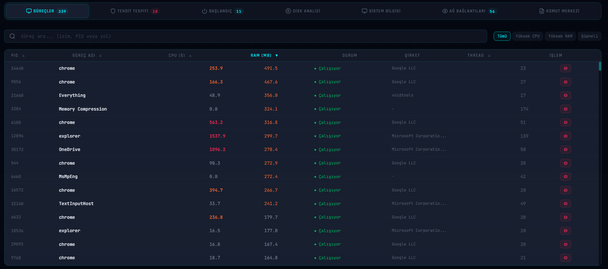
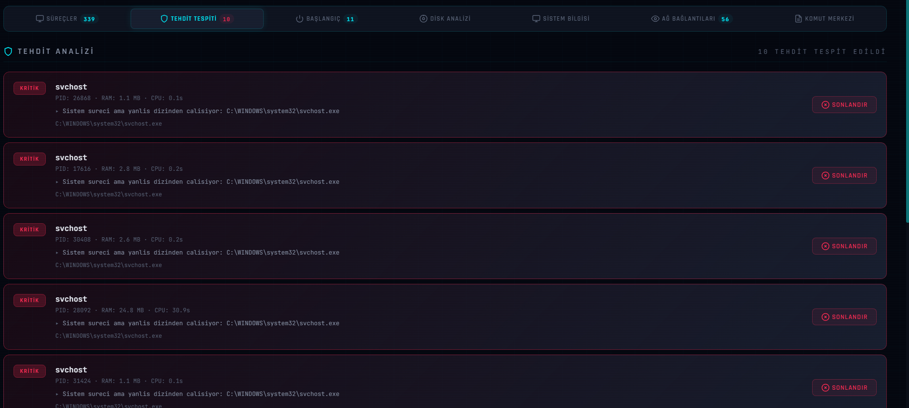
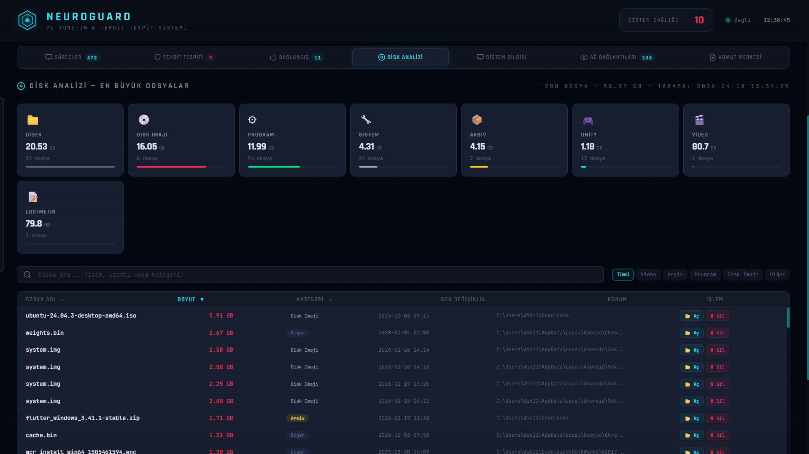
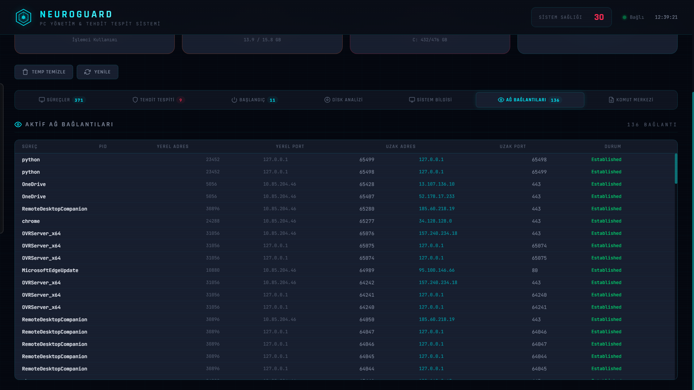
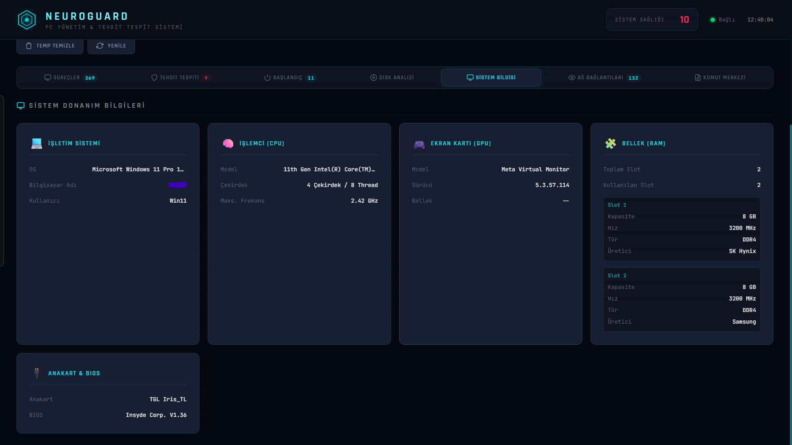

# NeuroGuard

**PC Yönetim ve Tehdit Tespit Sistemi**

NeuroGuard, Windows üzerinde çalışan yerel bir sistem monitörüdür. PowerShell ile sistem verisi toplar, Node.js ile bu veriyi HTTP üzerinden serve eder ve tarayıcı tabanlı bir dashboard ile görselleştirir. Kurulum gerektirmez, admin yetkisi istemez, arka planda sessizce çalışır.

---

## Ne Yapar

Sisteminizdeki CPU, RAM ve disk kullanımını gerçek zamanlı izler. Çalışan tüm processleri listeler. Şüpheli veya anormal davranış gösteren processleri tespit ederek tehdit seviyesi atar (critical / high / medium / low). Başlangıçta otomatik açılan programları listeler ve devre dışı bırakmanıza izin verir. 50 MB üzerindeki büyük dosyaları tarayıp kategorize eder. Aktif TCP bağlantılarını hangi process tarafından açıldığıyla birlikte gösterir. Tüm yapılan işlemleri (process sonlandırma, startup devre dışı bırakma, dosya silme vb.) loglar.

Dashboard'a `http://localhost:8777` adresinden ulaşırsınız.

---

## Ekran Görüntüleri

> Aşağıdaki görseller canlı dashboard'dan alınmıştır.

### Genel Görünüm — Gauge Panel ve Ağ Trafiği



*CPU, RAM, Disk göstergeleri ve gerçek zamanlı ağ trafiği grafiği.*

---

### Süreç Listesi



*Tüm çalışan süreçler PID, CPU, RAM, thread sayısı ve durum bilgisiyle listelenir. Sütun başlıklarına tıklayarak sıralama yapılabilir.*

---

### Tehdit Tespiti



*Anormal kaynak kullanan, temp klasöründen çalışan veya sistem süreci adını taklit eden processler otomatik olarak flaglenir.*

---

### Disk Analizi



*50 MB üzeri dosyalar kategori bazlı (Video, Arşiv, Disk İmajı, Program vb.) listelenir. Dosya konumu Explorer'da açılabilir veya doğrudan silinebilir.*

---

### Ağ Bağlantıları



*Established durumdaki TCP bağlantıları, hangi process tarafından açıldığıyla birlikte görüntülenir.*

---

### Sistem Bilgisi



*CPU, GPU, RAM slotları, anakart ve BIOS bilgileri tek ekranda.*

---

## Gereksinimler

- Windows 10 / 11
- PowerShell 5.1 veya üzeri (Windows'ta varsayılan olarak gelir)
- Node.js (https://nodejs.org) — sadece `node` komutunun PATH'te bulunması yeterli
- Modern bir tarayıcı (Chrome, Edge, Firefox)

---

## Kurulum ve Çalıştırma

Herhangi bir `npm install` veya paket kurulumu gerekmez. Projeyi klonlayın veya ZIP olarak indirin ve doğrudan çalıştırın.

```
git clone https://github.com/kullanici-adi/neuroguard.git
cd neuroguard
```

Sonrasında sadece batch dosyasını çalıştırın:

```
start-neuroguard.bat
```

Bu dosya şunları sırayla yapar:

1. `scripts/collector.ps1` — PowerShell ile sistem verisi toplamaya başlar (background'da, minimize edilmiş pencerede)
2. 6 saniye bekler — ilk veri dosyaları oluşsun diye
3. `scripts/server.js` — Node.js HTTP sunucusunu başlatır (8777 portunda)
4. 2 saniye bekler
5. `http://localhost:8777` adresini varsayılan tarayıcıda açar

---

## Durdurma

Batch penceresini kapatmak servisleri durdurmaz. Arka planda iki ayrı pencere çalışmaya devam eder.

Tamamen durdurmak için Görev Yöneticisi'nden (Ctrl+Shift+Esc):
- **"NeuroGuard Collector"** başlıklı powershell penceresini kapatın
- **"NeuroGuard Server"** başlıklı node penceresini kapatın

Ya da PowerShell'den:

```powershell
Stop-Process -Name "powershell" -ErrorAction SilentlyContinue
Stop-Process -Name "node" -ErrorAction SilentlyContinue
```

> Dikkat: Bu komutlar sistemdeki tüm powershell ve node processlerini sonlandırır. Başka şeyler açıksa selektif olun.

---

## Proje Yapısı

```
neuroguard/
├── index.html              # Dashboard UI (tek sayfa, framework yok)
├── app.js                  # Tüm frontend mantığı
├── style.css               # CSS (vanilla, değişken tabanlı)
├── start-neuroguard.bat    # Başlatıcı
├── scripts/
│   ├── collector.ps1       # Sistem veri toplayıcı (PowerShell)
│   ├── server.js           # HTTP sunucu + API endpoint'leri (Node.js)
│   ├── launcher.ps1        # Alternatif launcher
│   └── server.ps1          # Alternatif sunucu implementasyonu
└── data/                   # Runtime'da oluşur, JSON veri dosyaları burada tutulur
    ├── stats.json          # Anlık CPU/RAM/disk/ağ verileri
    ├── processes.json      # Çalışan process listesi
    ├── threats.json        # Flaglenen processler
    ├── startup.json        # Başlangıç programları
    ├── connections.json    # TCP bağlantıları
    ├── largefiles.json     # Büyük dosya tarama sonuçları
    ├── sysinfo.json        # Donanım bilgileri (başlangıçta bir kez toplanır)
    └── action_log.json     # İşlem geçmişi
```

`data/` klasörü `.gitignore`'da tanımlıdır — commit edilmez.

---

## Nasıl Çalışır

**Veri toplama katmanı (`collector.ps1`):**

Script her 3 saniyede bir çalışarak WMI/CIM sorguları ile CPU yüzdesini, RAM kullanımını, disk doluluk oranlarını, ağ I/O'sunu, çalışan processleri ve TCP bağlantılarını toplar. Her döngüde bu verileri `data/` klasörüne JSON olarak yazar.

Tehdit tespiti aynı döngü içinde yapılır. Her process için şu kurallara bakılır:
- CPU kullanımı 300 saniyenin üzerinde mi (ve bilinen güvenli liste dışında mı)?
- Yalnız yüksek bellek + bilinmeyen yayıncı kombinasyonu var mı?
- Process, `%TEMP%` veya `%TMP%` klasöründen mi çalışıyor?
- `svchost`, `lsass` gibi kritik sistem süreci adını kullanan ama `C:\Windows` dışından çalışan bir şey var mı?
- Gizli pencereli, yüksek thread sayılı, yüksek RAM kullanan ve yayıncısı bilinmeyen bir process var mı?

Büyük dosya taraması her 60 saniyede bir (20 × 3s döngü) çalışır. İlk başlangıçta da bir kez çalıştırılır. 50 MB üzeri dosyaları bulduğu yerlerde arar:
- `Downloads`, `Documents`, `Desktop`, `Videos`, `Music`, `Pictures`
- `OneDrive` dizinleri
- `Program Files`, `Program Files (x86)`
- `AppData\Local`
- `%TEMP%`

En büyük 200 dosyayı boyuta göre sıralı döndürür.

**Sunucu katmanı (`server.js`):**

`localhost:8777`'de Node.js HTTP sunucusu çalışır. Frontend dosyalarını (`index.html`, `app.js`, `style.css`) static olarak serve eder. API endpoint'leri `data/` klasöründeki JSON dosyalarını okuyup döner.

PowerShell'in ürettiği JSON dosyalarına BOM (Byte Order Mark) eklemesi bilinen bir davranıştır. Sunucu her dosyayı okurken BOM'u strip eder.

**API endpoint'leri:**

| Endpoint | Yöntem | Açıklama |
|---|---|---|
| `/api/stats` | GET | Anlık sistem istatistikleri |
| `/api/processes` | GET | Çalışan process listesi |
| `/api/threats` | GET | Tespit edilen tehditler |
| `/api/startup` | GET | Başlangıç programları |
| `/api/connections` | GET | Aktif TCP bağlantıları |
| `/api/largefiles` | GET | Büyük dosya tarama sonuçları |
| `/api/sysinfo` | GET | Donanım bilgileri |
| `/api/actionlog` | GET | İşlem geçmişi |
| `/api/action` | POST | İşlem gerçekleştir |

`/api/action` endpoint'i şu işlem tiplerini kabul eder:

```json
{ "type": "kill", "pid": 1234, "name": "suspicious.exe" }
{ "type": "disable_startup", "name": "BadApp", "location": "Registry (Current User)" }
{ "type": "clean_temp" }
{ "type": "open_location", "filePath": "C:\\Users\\...\\file.mp4" }
{ "type": "delete_file", "filePath": "C:\\Users\\...\\file.iso" }
```

**Frontend (`app.js` + `index.html`):**

Vanilla JS. Framework kullanılmamıştır. UI her 3 saniyede bir tüm API endpoint'lerine paralel istekler atar (`Promise.all`) ve ekranı günceller. Canvas API ile ağ trafiği grafiği çizilir (gönderilen ve alınan veri ayrı renkle). SVG tabanlı dairesel göstergeler CSS `stroke-dashoffset` animasyonu ile güncellenir.

Tehlikeli sayılan işlemler (process sonlandırma, startup devre dışı bırakma, dosya silme) bir modal ile onay alındıktan sonra çalışır.

---

## Sağlık Skoru Hesabı

0-100 arası bir skor. Başlangıç değeri 100, aşağıdaki koşullar skoru düşürür:

| Koşul | Düşüş |
|---|---|
| CPU > %90 | -30 |
| CPU > %70 | -20 |
| CPU > %50 | -10 |
| RAM > %90 | -30 |
| RAM > %75 | -20 |
| RAM > %60 | -10 |
| Ana disk > %90 dolu | -15 |
| Ana disk > %80 dolu | -10 |
| Her tespit edilen tehdit | -5 (max -25) |

Skor 70 altına düşünce sarı, 40 altına düşünce kırmızı gösterilir.

---

## Port Değiştirme

`scripts/server.js` dosyasının başındaki `PORT` sabitini değiştirin:

```js
const PORT = 8777;  // Bunu değiştirin
```

`start-neuroguard.bat` içindeki dashboard URL satırını da güncelleyin:

```
echo   Dashboard adresi: http://localhost:8777
start "" http://localhost:8777
```

---

## Veri Toplama Aralığı

`start-neuroguard.bat` içinde collector çağrılırken `-IntervalSeconds 3` parametresi geçilir. Bunu değiştirerek toplama sıklığını ayarlayabilirsiniz:

```bat
start "NeuroGuard Collector" /MIN powershell -ExecutionPolicy Bypass -NoProfile -NoExit -Command "& '%SCRIPTS%collector.ps1' -DataDir '%DATA%' -IntervalSeconds 5"
```

Büyük dosya tarama aralığı `collector.ps1`'in başındaki `$largeFileScanInterval` değişkeniyle kontrol edilir (default: 20 döngü = 60 saniye).

---

## Güvenlik Notu

NeuroGuard tamamen yerel çalışır. Dışarıya herhangi bir veri göndermez, internet bağlantısı kullanmaz. Sunucu yalnızca `127.0.0.1` (localhost) üzerine bind edilir:

```js
server.listen(PORT, '127.0.0.1', () => { ... });
```

Bu satırı `0.0.0.0` yaparsanız dashboard ağdaki diğer cihazlardan da erişilebilir olur — ama bu önerilmez, çünkü herhangi bir auth mekanizması yoktur.

---

## Katkı

Pull request açmaktan çekinmeyin. Büyük değişiklikler için önce bir issue açın.

Bildirilen bug'lar için şunları ekleyin:
- Windows sürümü
- Node.js sürümü (`node --version`)
- PowerShell sürümü (`$PSVersionTable.PSVersion`)
- `data/` klasöründeki JSON dosyalarından ilgili olanı (hassas veri içeriyorsa redact edin)

---

## Lisans

MIT

## Dev.
`Erkan TURGUT`